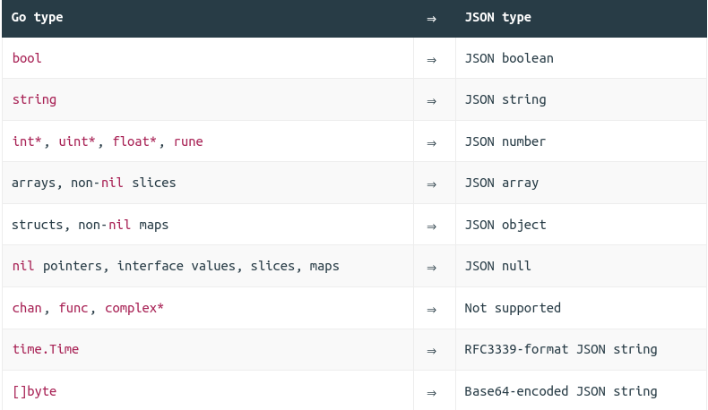

# letsGoFurther

## Ch2

> yes use for oth

```bash
├── bin             # compiled application binaries, ready for deployment
├── cmd             
│   └── api         # application specific code  
│       └── main.go
├── internal        # supporting packages
├── migrations      # sql mmigrations files for database
├── remote          # configuration files and setup script for prod server
├── go.mod
└── Makefile        # recipes for automated admin tasks
```

### How to version control an API

1. via prefix of URL `/v1/healthcheck` `/v2/healthcheck`
2. custom `Accept` and `Content-Type` headers eg: `Accept: application/vnd.greenlight-v1.`

| Method | Usage                                                                                                                                                                                          |
|--------|------------------------------------------------------------------------------------------------------------------------------------------------------------------------------------------------|
| GET    | Use for actions that retrieve information only and don’t change the state of your application or any data.                                                                                     |
| POST   | Use for non-idempotent actions that modify state. In the context of a REST API, POST is generally used for actions that create a new resource.                                                 |
| PUT    | Use for idempotent actions that modify the state of a resource at a specific URL. In the context of a REST API, PUT is generally used for actions that replace or update an existing resource. |
| PATCH  | Use for actions that partially update a resource at a specific URL. It’s OK for the action to be either idempotent or non-idempotent.                                                          |
| DELETE | Use for actions that delete a resource at a specific URL.                                                                                                                                      |

### Go Type Encoding

